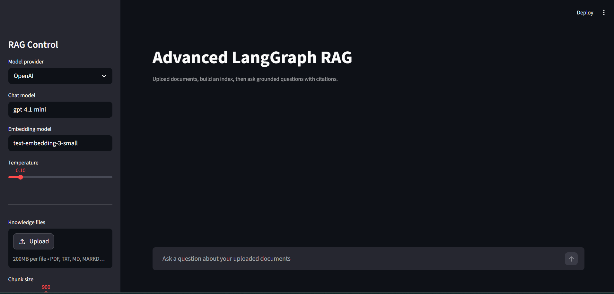

# Advanced RAG System with LangChain, LangGraph, and Streamlit


This project is a production-shaped Retrieval Augmented Generation app with:

- Streamlit chat UI and document upload
- LangChain document loading, chunking, embeddings, and Chroma vector search
- LangGraph workflow orchestration with query rewriting, retrieval, grading, generation, and answer validation
- Hybrid retrieval using vector search plus BM25 keyword search
- Source citations and confidence metadata
- OpenAI and Ollama model provider options

## Quick Start

```powershell
python -m venv .venv
.venv\Scripts\Activate
pip install -r requirements.txt
```

Add your `OPENAI_API_KEY` to `.env`, then run:

```bash
streamlit run app.py
```

For Ollama, install Ollama separately, pull a chat model and an embedding model, then select `Ollama` in the sidebar:

```bash
ollama pull llama3.1
ollama pull nomic-embed-text
```

## How It Works

1. Upload PDF, TXT, Markdown, or DOCX files in the sidebar.
2. The app chunks documents, embeds them, and stores them in a local Chroma index.
3. Each question enters a LangGraph workflow:
   - rewrites the query for retrieval
   - performs hybrid retrieval
   - grades retrieved chunks for relevance
   - generates a grounded answer with citations
   - validates groundedness and retries once when evidence is weak

## Project Layout

```text
app.py                 Streamlit application
src/config.py          Runtime settings and model provider config
src/document_loader.py Upload parsing and chunking
src/retrieval.py       Chroma + BM25 hybrid retriever
src/rag_graph.py       LangGraph RAG workflow
```
## Preview

